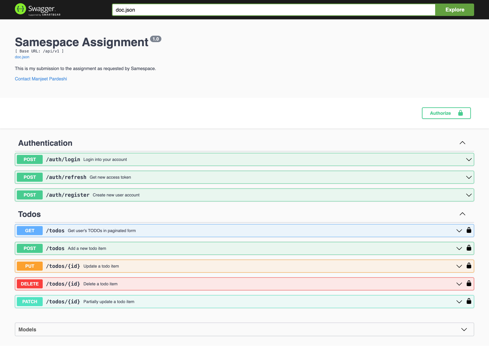

# Samespace Backend Assignment

This is my submission to the backend assignment as requested by the HR staff at Samespace.

## Functionality

### Bonus point
I have also implemented the requested sort feature :)

### User Auth
- [x] **JWT Auth**: Secure authentication using JSON Web Tokens (JWT) to manage user sessions.
- [x] **Refresh Token**: Mechanism to refresh JWT tokens without re-authenticating the user.

### Tests
- [x] **Auth Tests**: Comprehensive tests for authentication functionalities.
- [x] **Todo Tests**: Complete tests for all CRUD operations on todos.
- [x] **User Tests**: Thorough tests for user-related operations.

### Documentation
- [x] **Swagger Documentation**: API documentation generated using Swagger for easy reference and testing.

### Continuous Integration
- [x] **GitHub Actions**: Automated testing and deployment using GitHub Actions to ensure code quality and streamline CI/CD processes.

### Error Recovery
- [x] **Error Handling**: Robust error handling mechanisms to provide meaningful error messages and ensure application stability.
  
### Graceful Shutdown
- [x] **Graceful Shutdown**: The application includes a graceful shutdown mechanism to ensure ongoing processes are completed and connections are properly closed before the server shuts down.


## Critical Decisions

### Why Not Use ORM?
For this project, I opted against using the gocqlx ORM due to the simplicity of the CRUD queries, which did not justify the added complexity. Additionally, using an ORM can lock the project into that specific tool, making it harder to switch ORMs or databases later. A straightforward implementation ensures greater flexibility and easier maintenance.

### JWT for Authentication
JWTs provide a stateless and scalable solution for managing user sessions. They are compact, secure, and easy to integrate, making them ideal for modern web applications. The refresh token mechanism enhances security and user experience by allowing seamless token renewal.

### Why No Web Framework?
I chose not to use a full-fledged web framework to keep the application lightweight and maintain full control over the architecture. By leveraging Gorilla Mux for routing and custom middleware, I avoided the overhead and complexity of web frameworks. This approach allows for greater flexibility, finer-grained control, and better performance tuning, while simplifying debugging and reducing dependencies.

## Architecture

I have chosen a mix of domain-driven design (DDD) and clean architecture principles for this project. This approach ensures a well-structured and maintainable codebase, facilitating scalability and ease of testing.

### Project Structure

```plaintext
.
├── Makefile
├── bin
│   └── api
├── cmd
│   └── api
│       └── main.go
├── config.example.yaml
├── config.yaml
├── docs
│   ├── docs.go
│   ├── swagger.json
│   └── swagger.yaml
├── go.mod
├── go.sum
├── main.go
└── pkg
    ├── api
    │   ├── handler
    │   │   ├── auth.go
    │   │   ├── todo.go
    │   ├── middleware
    │   │   ├── auth.go
    │   │   ├── log.go
    │   ├── router
    │   │   └── router.go
    │   └── server
    │       └── server.go
    ├── config
    │   ├── config.go
    │   └── test.go
    ├── db
    │   └── scylla.go
    ├── model
    │   ├── auth.go
    │   ├── todo.go
    │   └── user.go
    ├── service
    │   ├── auth
    │   │   ├── auth.go
    │   │   ├── auth_test.go
    │   │   └── token.go
    │   ├── todo
    │   │   ├── todo.go
    │   │   └── todo_test.go
    │   └── user
    │       ├── user.go
    │       └── user_test.go
    └── utils
        ├── http.go
        ├── logger.go
        └── test.go

19 directories, 33 files
```

## Detailed Description

### User Authentication
The authentication module provides secure login and token management using JWT. The refresh token feature allows users to maintain their sessions without frequently re-authenticating, improving user experience.

### Todos
The todo service handles CRUD operations for todo items. It supports:
- Adding new todo items.
- Fetching paginated lists of todos.
- Filtering todos by status.
- Updating and patching todo items.
- Deleting todo items.

### Continuous Integration
Using GitHub Actions for CI/CD ensures that all code changes are tested automatically. This setup helps maintain code quality and reduces the risk of introducing bugs.

### Error Handling
The error recovery mechanism ensures that meaningful error messages are provided to the user. It also helps in debugging by logging detailed error information.

### Swagger Documentation
Swagger documentation provides a user-friendly interface to interact with the API, making it easier for developers to understand and test the API endpoints.

## Testing

### Authentication Tests
Tests cover all aspects of the authentication process, including login, token generation, and token refreshing.

### Todo Tests
Tests cover the full range of CRUD operations for todos. Each operation (add, get, update, patch, delete) is tested to ensure reliability and correctness.

### User Tests
Tests validate user creation, retrieval, and other user-related operations.

Certainly! Here's an improved version of the instructions:


## Running the Application

This project is fully containerized using Docker. Follow the steps below to get the application up and running:

1. **Configuration:**
   - In the root directory of the project, create a file named `config.yaml` based on the provided `config.example.yaml`. Ensure all necessary configurations are properly set in this file.

2. **Starting the Application:**
   - Open a terminal in the root directory of the project.
   - Execute the following command to start the application:
     ```bash
     docker-compose up
     ```

3. **Accessing the Application:**
   - By default, the application will be available on port `8080`. Open your browser and navigate to `http://localhost:8080` to access it.


## Swagger demo

You can check the Swagger-ui demo hosted here:


